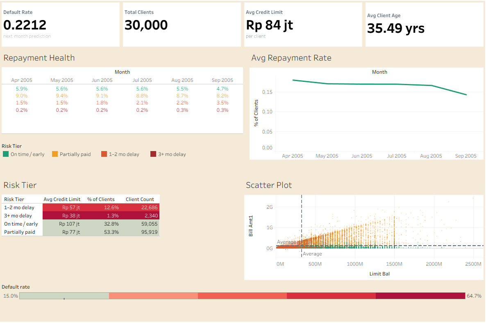

# tableau-credit-card-dashboard
Taken from a sample dataset on Kaggle, it contains 30,000 customer transaction records from April through September 2005 in Taiwan. This dataset also includes 25 variables, ranging from demographic information and credit limits to payment delinquency history, which can be evaluated based on a score.

# How To Use
To view the dashboard, download the CreditCardUsage_17911914509880.twbx file from /dashboards folder and open it using Tableau Public or Tableau Desktop.

# Viewing via Tableau Public
[Link](https://public.tableau.com/app/profile/nuzulia.adistianingrum/viz/CreditCardUsage_17911914509880/Dashboard1)
